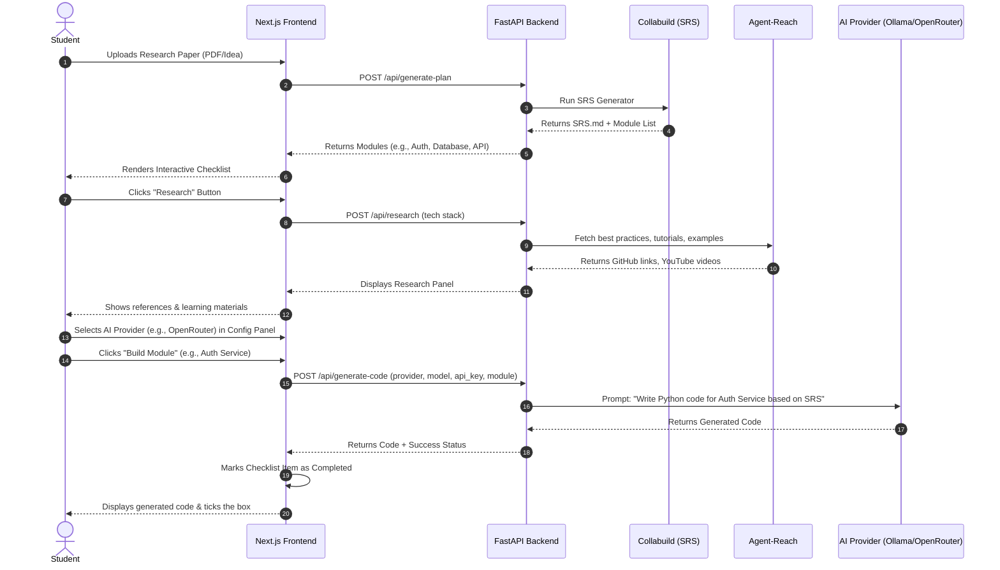
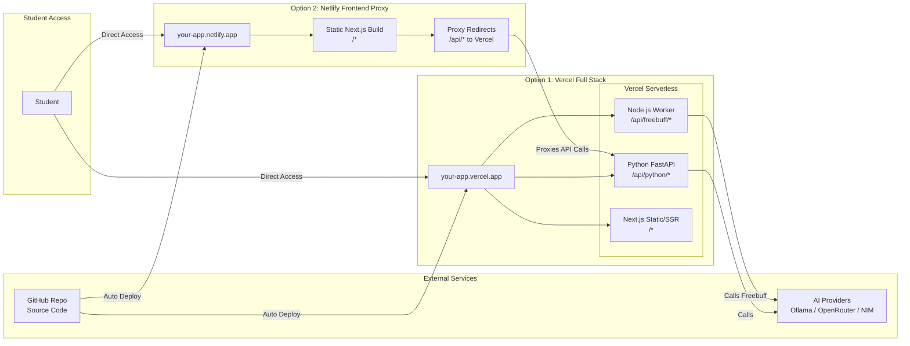

# BuildBot – Student AI Coding Assistant

> **From Research Paper → SRS → Checklist → Working Code — with Any AI, Anywhere**

[](https://vercel.com/new/clone?repository-url=https://github.com/karun99/buildbot)
[](https://app.netlify.com/start/deploy?repository=https://github.com/karun99/buildbot)

## Try the Thinking Playground

**Live Demo:** [http://you-ai-project.netlify.app](http://you-ai-project.netlify.app)
*See the AI "thinking" component in action—watch BuildBot plan, research, and generate code step-by-step.*

---

## Table of Contents

- [What is BuildBot?](#what-is-buildbot)
- [System Architecture (UML)](#system-architecture-uml)
- [User Journey (Sequence Diagram)](#user-journey-sequence-diagram)
- [Core Features](#core-features)
- [How It Works](#how-it-works)
- [AI Provider Support](#ai-provider-support)
- [Student AI Configuration Panel](#student-ai-configuration-panel)
- [Deployment Architecture (UML)](#deployment-architecture-uml)
- [Project Structure](#project-structure)
- [Deployment Guide](#deployment-guide)
  - [Deploy to Vercel (Full Stack)](#deploy-to-vercel-full-stack)
  - [Deploy to Netlify (Frontend Only + Proxy)](#deploy-to-netlify-frontend-only--proxy)
- [Local Development](#local-development)
- [Environment Variables](#environment-variables)
- [License](#license)

---

## What is BuildBot?

**BuildBot** is an open-source educational platform that helps students turn software documentation into actionable development checklists and working code — using **any AI provider** they choose.

Built on top of **Collabuild** (SRS generation from research papers), **Freebuff** (free AI coding agents), and **Agent-Reach** (internet access for AI agents), BuildBot gives students a complete pipeline:

> **Upload a paper** → **Generate SRS** → **Get a checklist** → **Research best practices** → **Build code with AI**

---

## System Architecture (UML)

This component diagram shows how the frontend, Python backend, Node.js worker, and external AI providers interact.

```mermaid
graph TD
    subgraph "Student's Browser"
        UI[Next.js Frontend<br/>Upload / Checklist / Config]
        Config[AI Config Panel<br/>localStorage]
    end

    subgraph "Vercel Serverless (Backend)"
        API[FastAPI Python<br/>Orchestrator]
        Collabuild[Collabuild Engine<br/>Paper → SRS → Modules]
        AgentReach[Agent-Reach<br/>Internet Research]
        LLMClient[Pluggable LLM Client<br/>Abstraction Layer]
        FreebuffWorker[Node.js Worker<br/>Freebuff CLI]
    end

    subgraph "External AI Providers (Student Configurable)"
        Ollama[Ollama<br/>Local]
        OpenRouter[OpenRouter<br/>Cloud]
        Nvidia[NVIDIA NIM<br/>Cloud]
        LlamaCPP[llama.cpp<br/>Local]
        Ooba[Oobabooga<br/>Local]
    end

    UI -->|Upload Paper| API
    UI -->|Reads/Saves| Config
    Config -->|Sends Provider Choice| API

    API -->|1. Generate SRS| Collabuild
    API -->|2. Fetch Tutorials| AgentReach
    API -->|3. Generate Code| LLMClient
    API -->|Alternative Code Gen| FreebuffWorker

    LLMClient -->|HTTP Requests| Ollama
    LLMClient -->|HTTP Requests| OpenRouter
    LLMClient -->|HTTP Requests| Nvidia
    LLMClient -->|HTTP Requests| LlamaCPP
    LLMClient -->|HTTP Requests| Ooba

    Collabuild -->|Returns SRS + Modules| API
    AgentReach -->|Returns Research| API
    FreebuffWorker -->|Returns Code| API
    LLMClient -->|Returns Code| API
    API -->|Checklist + Code| UI
```



---

## User Journey (Sequence Diagram)

This sequence diagram walks through the entire student experience—from uploading a paper to checking off completed modules.



---

## Core Features

| Feature | Description |
|---------|-------------|
| Paper to SRS | Upload a research paper or project idea; Collabuild generates an IEEE 830-compliant SRS. |
| Smart Checklist | The SRS is parsed into a visual, trackable module checklist with progress tracking. |
| AI Research | Agent-Reach fetches tutorials, similar projects, and best practices from GitHub, YouTube, Reddit, and more. |
| AI Code Generation | Freebuff (or your chosen AI) writes production-ready code for each module. |
| Any AI Provider | Switch between Ollama, OpenRouter, NVIDIA NIM, llama.cpp, Oobabooga — no redeploy needed. |
| Student-Friendly UI | Clean dashboard with configuration panel, live progress, and code preview. |
| One-Click Deploy | Deploy to Vercel (full-stack) or Netlify (static frontend) with the buttons above. |

---

## How It Works

```
+------------------------------------------------------------------+
|                    STUDENT UPLOADS RESEARCH PAPER                  |
+------------------------------------+-----------------------------+
                                     v
+------------------------------------------------------------------+
|  STEP 1: Collabuild generates SRS & module breakdown             |
|  Output: SRS.md, module list, SDLC plan                          |
+------------------------------------+-----------------------------+
                                     v
+------------------------------------------------------------------+
|  STEP 2: BuildBot renders an interactive checklist               |
|  Students see: "Module 1: Auth Service — [ ] Build"              |
+------------------------------------+-----------------------------+
                                     v
+------------------------------------------------------------------+
|  STEP 3: (Optional) Agent-Reach enriches with internet data      |
|  Fetches tutorials, examples, best practices from the web        |
+------------------------------------+-----------------------------+
                                     v
+------------------------------------------------------------------+
|  STEP 4: AI (Freebuff/Ollama/OpenRouter/etc.) writes code        |
|  Generates files per module, displayed in the UI                 |
+------------------------------------------------------------------+
```

---

## AI Provider Support

BuildBot is built with a pluggable AI architecture. Students can configure their preferred AI backend directly from the UI — no environment variables or redeploys required.

| Provider | Type | Base URL | Needs API Key? | Best For |
|----------|------|----------|---------------|----------|
| Ollama | Local | http://localhost:11434 | No | Offline, free, runs on laptop |
| llama.cpp | Local | http://localhost:8080/v1 | No | Low-resource local inference |
| Oobabooga (TextGen) | Local | http://localhost:5000/v1 | No | Advanced local fine-tuning |
| OpenRouter | Cloud | https://openrouter.ai/api/v1 | Yes (free credits) | 100+ models, no hardware needed |
| NVIDIA NIM | Cloud | https://integrate.api.nvidia.com/v1 | Yes (free tier) | GPU-optimized enterprise cloud |

### Getting Free API Keys

- **OpenRouter:** Sign up at [openrouter.ai](https://openrouter.ai) → free credits on signup.
- **NVIDIA NIM:** Sign up at [build.nvidia.com](https://build.nvidia.com) → 5,000 free inference calls.

---

## Student AI Configuration Panel

BuildBot includes a live configuration panel in the UI that saves settings to localStorage. Students can:

1. Select any provider from a dropdown.
2. Enter an API key (for cloud providers) or a Base URL (for local servers).
3. Specify a custom model name (optional — uses provider default if left blank).
4. Start building — the app uses the selected provider immediately.

> Keys are stored only in the student's browser (localStorage). No sensitive data is ever sent to the BuildBot backend.

---

## Deployment Architecture (UML)

This diagram illustrates how BuildBot is deployed across Vercel (backend + frontend) and Netlify (static frontend proxy).



---

## Project Structure

```
buildbot/
├── api/
│   ├── python/                      # Python serverless functions
│   │   ├── main.py                  # FastAPI app (Collabuild + Agent-Reach)
│   │   ├── llm_client.py            # Pluggable AI client (Ollama, OpenRouter, etc.)
│   │   ├── collabuild_utils.py      # Collabuild SRS generator wrapper
│   │   └── requirements.txt         # Python dependencies
│   └── node/                        # Node.js serverless functions
│       ├── freebuff.js              # Freebuff CLI wrapper
│       └── package.json             # Node dependencies
├── frontend/                        # Next.js UI
│   ├── app/
│   │   ├── page.tsx                 # Main dashboard
│   │   ├── components/
│   │   │   └── AIConfig.tsx         # AI configuration panel
│   │   ├── globals.css
│   │   └── layout.tsx
│   ├── package.json
│   ├── next.config.js
│   ├── tailwind.config.ts
│   ├── postcss.config.js
│   └── tsconfig.json
├── vercel.json                      # Vercel routing configuration
├── netlify.toml                     # Netlify build + proxy configuration
├── .gitignore
└── README.md
```

---

## Deployment Guide

### Deploy to Vercel (Full Stack — Recommended)

Vercel supports both Python and Node.js serverless functions in the same project.

**Step 1:** Fork/clone the BuildBot repository.

**Step 2:** Push to GitHub.

**Step 3:** Go to [Vercel Dashboard](https://vercel.com) → Add New Project → Import your repository.

**Step 4:** Vercel will auto-detect `vercel.json`. Add these environment variables:

| Variable | Purpose | Example |
|----------|---------|---------|
| AI_PROVIDER | Default AI backend | openrouter |
| AI_MODEL | Default model | meta-llama/llama-3.1-8b-instruct |
| OPENROUTER_API_KEY | For OpenRouter (optional) | sk-or-v1-... |
| NVIDIA_API_KEY | For NVIDIA NIM (optional) | nvapi-... |

**Step 5:** Click Deploy → Your app is live at `https://your-app.vercel.app`.

---

### Deploy to Netlify (Frontend Only + Proxy to Vercel)

Since Netlify does not run Python/Node backends natively, deploy only the static frontend and proxy API calls to your Vercel backend.

**Step 1:** Set `output: 'export'` in `frontend/next.config.js`.

**Step 2:** Update `netlify.toml` with your Vercel URL:

```toml
[build]
  command = "cd frontend && npm install && npm run build"
  publish = "frontend/out"

[[redirects]]
  from = "/api/*"
  to = "https://your-vercel-app.vercel.app/api/:splat"
  status = 200
  force = true
```

**Step 3:** Go to [Netlify Dashboard](https://app.netlify.com) → Add new site → Import from Git.

**Step 4:** Set Publish directory to `frontend/out` and click Deploy.

---

## Local Development

```bash
# 1. Clone the repository
git clone https://github.com/karun99/buildbot.git
cd buildbot

# 2. Install Python dependencies
cd api/python
pip install -r requirements.txt

# 3. Install Node.js dependencies
cd ../node
npm install

# 4. Install frontend dependencies
cd ../../frontend
npm install

# 5. Run the Python API locally
cd ../api/python
uvicorn main:app --reload --port 8000

# 6. Run the Next.js frontend (in a new terminal)
cd frontend
npm run dev

# 7. Open http://localhost:3000
```

### Running with Local AI (Ollama)

```bash
# Start Ollama
ollama serve

# Pull a model
ollama pull llama3.1

# In the BuildBot UI, select "Ollama" and set Base URL to http://localhost:11434
```

---

## Environment Variables

| Variable | Used By | Purpose |
|----------|---------|---------|
| AI_PROVIDER | Python API | Default AI provider (ollama, openrouter, nvidia_nim, llama_cpp, oobabooga) |
| AI_MODEL | Python API | Default model name |
| OPENROUTER_API_KEY | Python API | OpenRouter API key |
| NVIDIA_API_KEY | Python API | NVIDIA NIM API key |
| OLLAMA_URL | Python API | Custom Ollama URL (default: http://localhost:11434) |
| LLAMA_CPP_URL | Python API | llama.cpp OpenAI-compatible endpoint |
| OOBABOOGA_URL | Python API | Oobabooga TextGen endpoint |
| VERCEL_URL | Python API | Internal Vercel URL for function-to-function calls |

---

## License

MIT License — Free for educational and commercial use.

---

## Acknowledgments

- **Collabuild** — SRS generation from research papers
- **Freebuff** — Free AI coding agents with no subscription
- **Agent-Reach** — Internet access for AI agents
- **Ollama** — Local LLM runtime
- **OpenRouter** — Unified API for 100+ models
- **NVIDIA NIM** — GPU-optimized inference

---

Built with heart for students everywhere.
Thinking Component Live at: [http://you-ai-project.netlify.app](http://you-ai-project.netlify.app)
